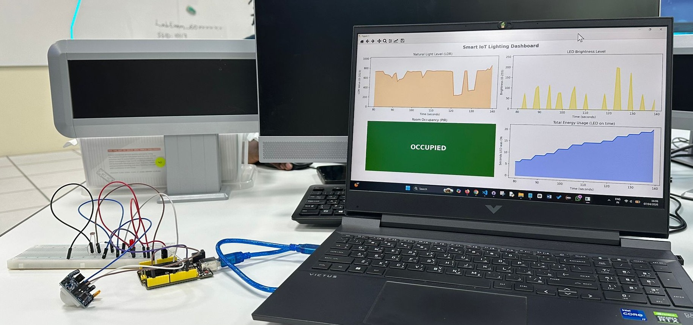
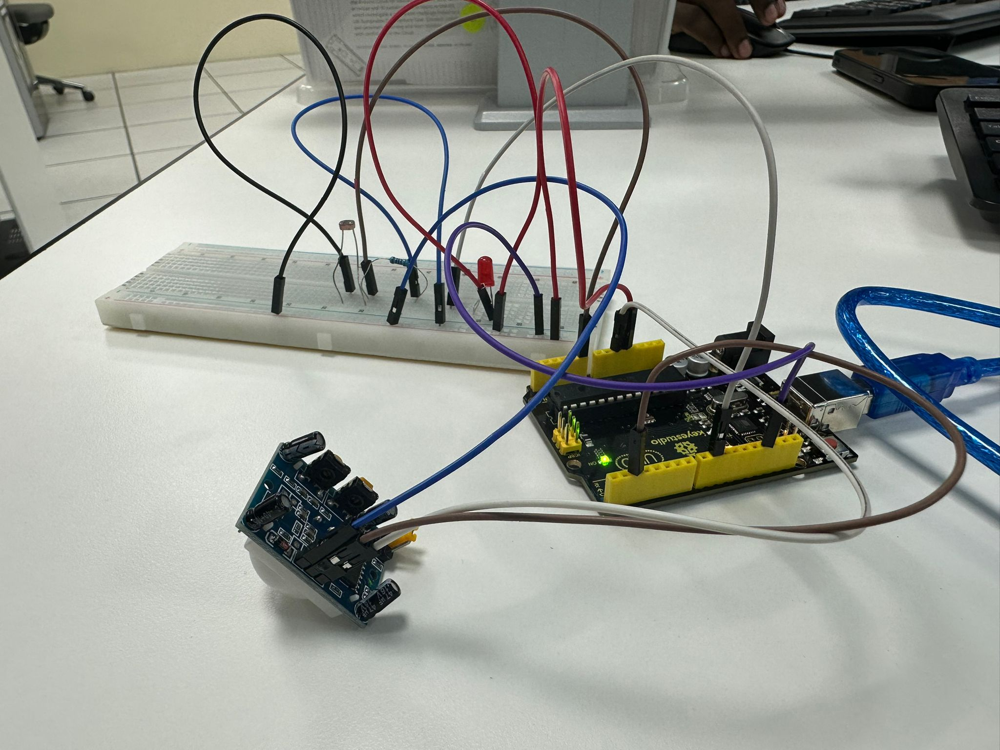

# Smart IoT Lighting System


An intelligent lighting system built with Arduino Uno, PIR and LDR sensors that automatically adapts LED brightness based on occupancy and ambient light levels — with a real-time Python dashboard for live visualization.

---

## Demo

| Dashboard | Circuit Setup |
|---|---|
|  |  |

---

## How It Works

The system makes two decisions continuously:

```
PIR Sensor  → WHEN to turn the light on  (is someone in the room?)
LDR Sensor  → HOW BRIGHT the light should be  (how much natural light exists?)
```

This implements a concept called **Daylight Harvesting** — the bulb continuously compensates for natural light to maintain consistent room brightness while minimizing energy usage:

```
Bright room (lots of sunlight) → LED dims or turns off  → saves energy
Dark room (no sunlight)        → LED brightens          → maintains comfort
No occupancy                   → LED off completely     → maximum savings
```

### Brightness Formula
```cpp
brightness = 255 - (ldrValue / 1023.0 * 255)
```
As natural light decreases, artificial light increases proportionally.

---

## Hardware Requirements

| Component | Quantity | Purpose |
|---|---|---|
| Arduino Uno | 1 | Microcontroller |
| PIR Sensor | 1 | Occupancy detection |
| LDR Sensor | 1 | Ambient light measurement |
| LED (Red) | 1 | Smart light output |
| 220Ω Resistor | 1 | LED current limiting |
| 10KΩ Resistor | 1 | LED current limiting |
| Jumper Wires | Several | Connections |
| Breadboard | 1 | Circuit assembly |

---

## Circuit Wiring

```
LDR Sensor  → A0   (Analog pin)
PIR Sensor  → D2   (Digital pin)
LED         → D9   (PWM pin ~)

LED wiring:
Pin 9 → 220Ω resistor → LED (long leg) → GND (short leg)
```

---

## Software Requirements

### Arduino
- [Arduino IDE](https://www.arduino.cc/en/software)

### Python
```bash
pip install pyserial
pip install matplotlib
pip install pyqt5
```

---

## Getting Started

### Step 1 — Upload Arduino Sketch
1. Open `smart_lighting.ino` in Arduino IDE
2. Select your board: `Tools → Board → Arduino Uno`
3. Select your port: `Tools → Port → COM_` (check Device Manager)
4. Click Upload

### Step 2 — Run Python Dashboard
1. Note your COM port from Arduino IDE (bottom right corner)
2. Open `dashboard.py`
3. Change the port:
```python
PORT = 'COM3'  # change to your port
```
4. **Close Arduino Serial Monitor** — Python and Serial Monitor cannot use the same port simultaneously!
5. Run the dashboard:
```bash
python dashboard.py
```

---

## Live Dashboard

The Python dashboard displays 4 live panels updating every second:

| Panel | Description |
|---|---|
| 🟠 Natural Light Level | Raw LDR sensor reading (0-1023) |
| 🟡 LED Brightness | PWM brightness responding to light (0-255) |
| 🟢🔴 Room Occupancy | Live green/red indicator from PIR sensor |
| 🔵 Energy Usage | Cumulative seconds LED was ON |

---

## Project Structure

```
smart-iot-lighting/
│
├── arduino/
│   └── smart_lighting.ino      # Main Arduino sketch
│
├── python/
│   └── dashboard.py            # Live Python dashboard
│
├── images/
│   ├── circuit.png             # Circuit setup photo
│   └── dashboard.png           # Dashboard screenshot
│
└── README.md
```

---

## Key Design Decisions

### Why PWM Instead of Simple ON/OFF?
A basic ON/OFF system wastes energy — turning the LED to full brightness even when the room only needs partial lighting. PWM allows the LED to operate at the **exact brightness needed** based on current natural light, saving energy continuously throughout the day.

### Why Not Machine Learning?
We evaluated using Linear Regression to optimize brightness but concluded that the relationship between natural light and required artificial light is deterministic — making ML redundant for this specific problem. A genuine ML use case would require human comfort feedback as a target variable collected over weeks, which is not feasible in a competition setting. The system achieves intelligent optimization through well designed sensor logic instead.

---

## How to Calibrate

If the LED behaves unexpectedly in your environment:

1. Open Arduino Serial Monitor
2. Cover and uncover the LDR
3. Note the raw values printed
4. The brightness formula automatically scales to your sensor's range

---

## Built For

**Smart IoT Lighting Challenge** — Skills Day IoT Competition 2026
Team size: 3 | Difficulty: Medium
April 1, 2026 | 12:00 PM - 3:00 PM

---

## Authors

> Maymona Mustafa
> 
> Anisa Salsabila
> 
> Arlene Riona

---

## License

This project is licensed under the MIT License — feel free to use and modify for your own projects!
